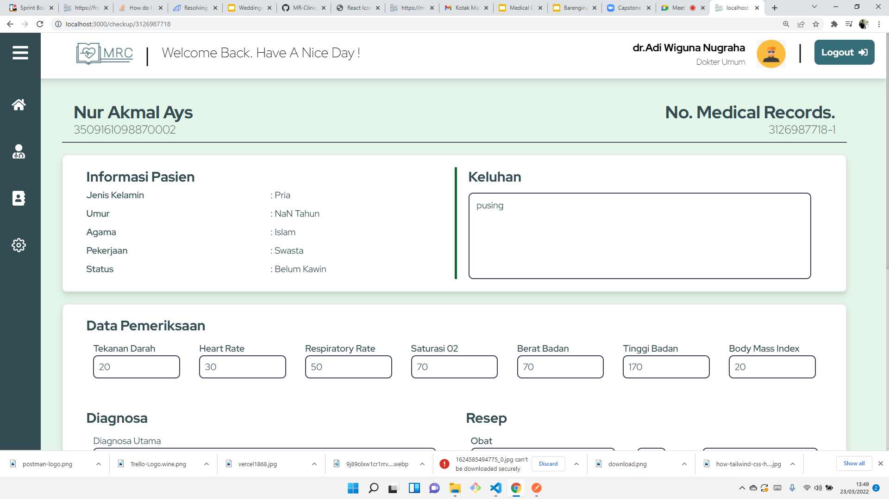

                                                   Mr clinic


> this project help the user as a patient get a medical record realtime, help the user to make an appointment with doctor, and help the doctor organize the data

- Live demo #1 [_https://mrclinic.netlify.app_]
- Live demo #2 [_https://frontend-mr-clinic.vercel.app_]
- BackEnd Repository [_https://github.com/MR-Clinic/be_]
- Quality Assurance Repository[_https://github.com/MR-Clinic/Quality-Assurance_]
- Figma Design Link [_https://github.com/MR-Clinic/Quality-Assurance_]

## Table of Contents

- [General Info](#general-information)
- [Technologies Used](#technologies-used)
- [Built With](#Built-With)
- [Features](#features)
- [Screenshots](#screenshots)
- [Setup](#setup)
- [Project Status](#project-status)
- [Room for Improvement](#room-for-improvement)
- [Acknowledgements](#acknowledgements)
- [Contact](#contact)

## General Information

- our projects make an web based organizer that help the doctor to make an appointment with patient,

## Technologies Used

- Next.js(https://nextjs.org/) - version 12.1.0
- TailwindCss(https://nextjs.org/) - version 3.0.23

## Built With

- Next Js(https://nextjs.org/) - Next Js simplified HTML, routing and interactions for rapid web development
- Tailwind Css(https://tailwindui.com/) - simplified to styling, with inline styling
- React-icons(https://react-icons.github.io/react-icons/search)
- axios(https://github.com/axios/axios/)
- moment(https://momentjs.com/)
- react-redux(https://react-redux.js.org/)
- redux-thunk(https://github.com/reduxjs/redux-thunk)
- sweetalert(https://sweetalert.js.org/guides/)

## Features

List the ready features here:

- register - sign in - sign out with regex, on username, email input and password validation
- doctor can check anytime patient data, and fill the patient medical record
- doctor and admin can check how much patient visit (daily report, and total report)
- user type validation ( the patient can't access doctor page, etc)
- patient can make an appointment with doctor (registration needed),patient can cancelled the appointment, and patient can get history visit report (with medicine recipe)
- auto generate account on admin, doctor can edit the data (username, password, form data, admin password, etc.)

## Screenshots

                Landing page section


                Dashboard page


                Diagnose (doctor page)



## Setup

to run this project, install it locally using npm

```
$ cd ../Frontend
$ npm install
$ npm run dev
```

## Project Status

Project is: _no longer being worked on_. this is our final project, so feel free to everyone that wants to elaborate and imporve this project

## Room for Improvement

Room for improvement:

- Improvement to be done add appointment with doctor based on patient location

To do:

- Feature to be added search doctor on patient dashboard, add image on diagnose doctor
- Feature to be added edit patient profile, edit doctor profile, etc
- make this website responsive and mobile friendly

## Acknowledgements

Give credit here.

- This project was inspired by halodoc and
- Many thanks to our team, FE, QA and BE Group three. so many things missing guys, we've worked hard, so best appraise for us, thanks for the good work !

## Contact

- Created by [Rizki](https://github.com/Rizkiawenkcode) - feel free to contact me!
- Created by [akmal](https://github.com/akmalays) - feel free to contact me!
